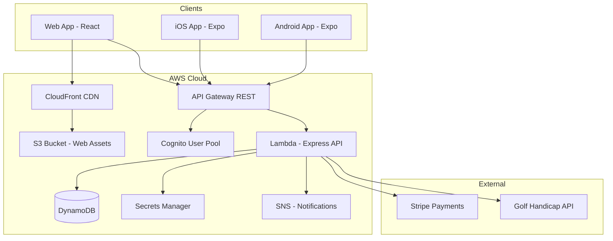
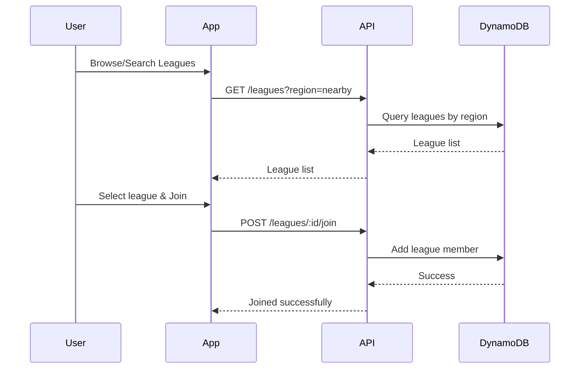
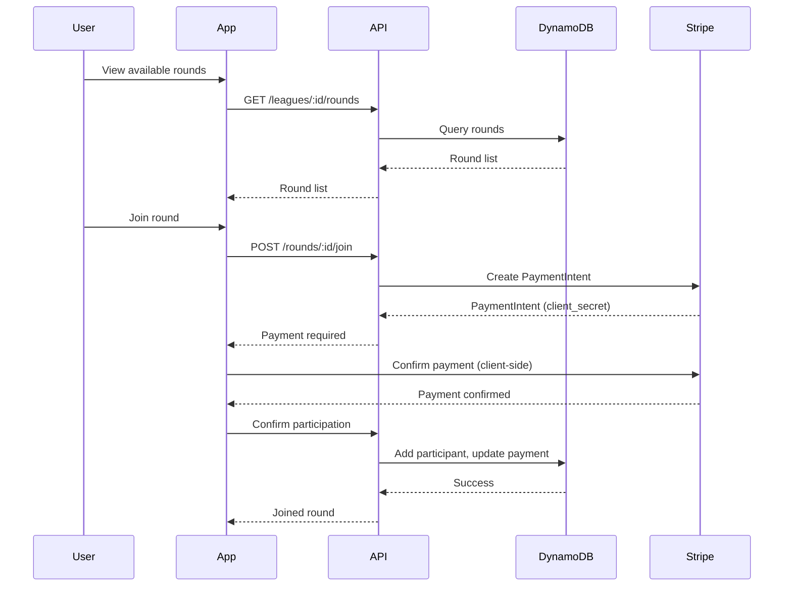
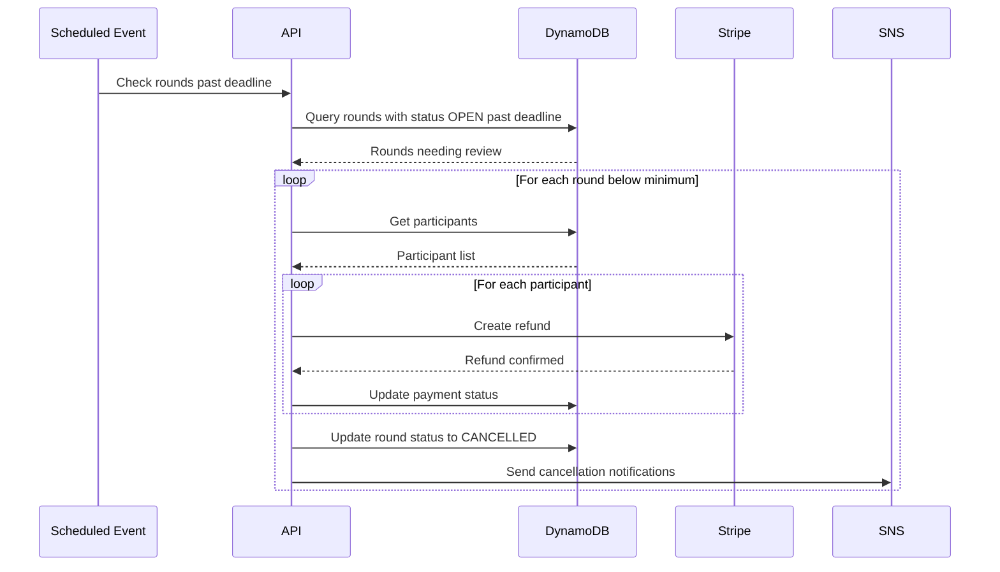

# Architecture Overview

## System Architecture



## Data Model

### DynamoDB Tables

#### Users Table

| Attribute     | Type | Description                                      |
| ------------- | ---- | ------------------------------------------------ |
| pk            | S    | `USER#{sportType}`                               |
| sk            | S    | `USER#{userId}`                                  |
| gsi1pk        | S    | `USER#{email}`                                   |
| gsi1sk        | S    | `USER#{userId}`                                  |
| userId        | S    | Unique user ID (UUID)                            |
| email         | S    | User email                                       |
| firstName     | S    | First name                                       |
| lastName      | S    | Last name                                        |
| displayName   | S    | Display name                                     |
| avatarUrl     | S    | Profile picture URL                              |
| location      | M    | `{ lat, lng, city, country }`                    |
| sportProfiles | M    | Sport-specific profiles (handicap, rating, etc.) |
| createdAt     | S    | ISO timestamp                                    |
| updatedAt     | S    | ISO timestamp                                    |

#### Leagues Table

| Attribute          | Type | Description                                      |
| ------------------ | ---- | ------------------------------------------------ |
| pk                 | S    | `LEAGUE#{sportType}`                             |
| sk                 | S    | `LEAGUE#{leagueId}`                              |
| gsi1pk             | S    | `LEAGUE#{region}`                                |
| gsi1sk             | S    | `LEAGUE#{leagueId}`                              |
| leagueId           | S    | Unique league ID (UUID)                          |
| name               | S    | League name                                      |
| description        | S    | League description                               |
| sportType          | S    | Sport type (GOLF, TENNIS, etc.)                  |
| category           | S    | Category (OPEN, WOMEN, KIDS, BEGINNERS, SENIORS) |
| region             | S    | Geographic region                                |
| location           | M    | `{ lat, lng, city, country, address }`           |
| maxMembers         | N    | Maximum members allowed                          |
| memberCount        | N    | Current member count                             |
| entryFee           | N    | Fee to join a round (in cents)                   |
| minPlayersPerRound | N    | Minimum players needed for a round               |
| maxPlayersPerRound | N    | Maximum players per round                        |
| rules              | S    | League-specific rules                            |
| imageUrl           | S    | League image                                     |
| isActive           | BOOL | Whether league is active                         |
| createdBy          | S    | User ID of creator                               |
| createdAt          | S    | ISO timestamp                                    |
| updatedAt          | S    | ISO timestamp                                    |

#### League Members Table

| Attribute | Type | Description                       |
| --------- | ---- | --------------------------------- |
| pk        | S    | `LEAGUEMEMBER#{sportType}`        |
| sk        | S    | `LEAGUE#{leagueId}#USER#{userId}` |
| gsi1pk    | S    | `USER#{userId}`                   |
| gsi1sk    | S    | `LEAGUE#{leagueId}`               |
| leagueId  | S    | League ID                         |
| userId    | S    | User ID                           |
| role      | S    | ADMIN, MODERATOR, MEMBER          |
| joinedAt  | S    | ISO timestamp                     |
| status    | S    | ACTIVE, SUSPENDED, LEFT           |

#### Rounds Table

| Attribute            | Type | Description                                             |
| -------------------- | ---- | ------------------------------------------------------- |
| pk                   | S    | `ROUND#{sportType}`                                     |
| sk                   | S    | `ROUND#{roundId}`                                       |
| gsi1pk               | S    | `LEAGUE#{leagueId}`                                     |
| gsi1sk               | S    | `ROUND#{scheduledDate}`                                 |
| roundId              | S    | Unique round ID (UUID)                                  |
| leagueId             | S    | League ID                                               |
| sportType            | S    | Sport type                                              |
| scheduledDate        | S    | ISO date of the round                                   |
| scheduledTime        | S    | Time of the round                                       |
| venue                | M    | `{ name, address, lat, lng }`                           |
| status               | S    | OPEN, FULL, IN_PROGRESS, COMPLETED, CANCELLED, REFUNDED |
| minPlayers           | N    | Minimum players required                                |
| maxPlayers           | N    | Maximum players allowed                                 |
| currentPlayers       | N    | Current player count                                    |
| entryFee             | N    | Fee in cents                                            |
| registrationDeadline | S    | ISO timestamp                                           |
| createdBy            | S    | User ID                                                 |
| createdAt            | S    | ISO timestamp                                           |
| updatedAt            | S    | ISO timestamp                                           |

#### Round Participants Table

| Attribute     | Type | Description                               |
| ------------- | ---- | ----------------------------------------- |
| pk            | S    | `ROUNDPARTICIPANT#{sportType}`            |
| sk            | S    | `ROUND#{roundId}#USER#{userId}`           |
| gsi1pk        | S    | `USER#{userId}`                           |
| gsi1sk        | S    | `ROUND#{roundId}`                         |
| roundId       | S    | Round ID                                  |
| userId        | S    | User ID                                   |
| paymentId     | S    | Stripe payment intent ID                  |
| paymentStatus | S    | PENDING, PAID, REFUNDED                   |
| status        | S    | REGISTERED, CONFIRMED, CANCELLED, NO_SHOW |
| joinedAt      | S    | ISO timestamp                             |

#### Scores Table

| Attribute  | Type | Description                     |
| ---------- | ---- | ------------------------------- |
| pk         | S    | `SCORE#{sportType}`             |
| sk         | S    | `ROUND#{roundId}#USER#{userId}` |
| gsi1pk     | S    | `USER#{userId}`                 |
| gsi1sk     | S    | `SCORE#{roundId}`               |
| gsi2pk     | S    | `LEAGUE#{leagueId}`             |
| gsi2sk     | S    | `SCORE#{scheduledDate}`         |
| scoreId    | S    | Unique score ID                 |
| roundId    | S    | Round ID                        |
| leagueId   | S    | League ID                       |
| userId     | S    | User ID                         |
| sportType  | S    | Sport type                      |
| scoreData  | M    | Sport-specific score data       |
| totalScore | N    | Calculated total score          |
| verified   | BOOL | Whether score is verified       |
| verifiedBy | S    | User ID of verifier             |
| createdAt  | S    | ISO timestamp                   |
| updatedAt  | S    | ISO timestamp                   |

#### Conversations Table

| Attribute      | Type | Description                            |
| -------------- | ---- | -------------------------------------- |
| pk             | S    | `CONVERSATION#{sportType}`             |
| sk             | S    | `CONVERSATION#{conversationId}`        |
| gsi1pk         | S    | `LEAGUE#{leagueId}`                    |
| gsi1sk         | S    | `CONVERSATION#{conversationId}`        |
| conversationId | S    | Unique conversation ID                 |
| leagueId       | S    | League ID (optional, for league chats) |
| type           | S    | DIRECT, GROUP, LEAGUE                  |
| participants   | L    | List of user IDs                       |
| name           | S    | Conversation name (for groups)         |
| lastMessageAt  | S    | ISO timestamp                          |
| createdAt      | S    | ISO timestamp                          |

#### Chat Messages Table

| Attribute      | Type | Description                     |
| -------------- | ---- | ------------------------------- |
| pk             | S    | `CHATMESSAGE#{sportType}`       |
| sk             | S    | `MSG#{timestamp}#{messageId}`   |
| gsi1pk         | S    | `CONVERSATION#{conversationId}` |
| gsi1sk         | S    | `MSG#{timestamp}`               |
| messageId      | S    | Unique message ID               |
| conversationId | S    | Conversation ID                 |
| userId         | S    | Sender user ID                  |
| content        | S    | Message content                 |
| type           | S    | TEXT, IMAGE, SYSTEM             |
| createdAt      | S    | ISO timestamp                   |

#### Follows Table

| Attribute   | Type | Description                                     |
| ----------- | ---- | ----------------------------------------------- |
| pk          | S    | `FOLLOW#{sportType}`                            |
| sk          | S    | `FOLLOWER#{followerId}#FOLLOWING#{followingId}` |
| gsi1pk      | S    | `FOLLOWING#{followingId}`                       |
| gsi1sk      | S    | `FOLLOWER#{followerId}`                         |
| followerId  | S    | User who is following                           |
| followingId | S    | User being followed                             |
| createdAt   | S    | ISO timestamp                                   |

#### Payments Table

| Attribute             | Type | Description                          |
| --------------------- | ---- | ------------------------------------ |
| pk                    | S    | `PAYMENT#{sportType}`                |
| sk                    | S    | `PAYMENT#{paymentId}`                |
| gsi1pk                | S    | `USER#{userId}`                      |
| gsi1sk                | S    | `PAYMENT#{createdAt}`                |
| gsi2pk                | S    | `ROUND#{roundId}`                    |
| gsi2sk                | S    | `PAYMENT#{paymentId}`                |
| paymentId             | S    | Unique payment ID                    |
| userId                | S    | User ID                              |
| roundId               | S    | Round ID                             |
| stripePaymentIntentId | S    | Stripe payment intent ID             |
| amount                | N    | Amount in cents                      |
| currency              | S    | Currency code (GBP, USD, etc.)       |
| status                | S    | PENDING, SUCCEEDED, REFUNDED, FAILED |
| refundReason          | S    | Reason for refund                    |
| createdAt             | S    | ISO timestamp                        |
| updatedAt             | S    | ISO timestamp                        |

## API Endpoints

### Authentication (Cognito)

- `POST /auth/register` - Register new user
- `POST /auth/login` - Login
- `POST /auth/verify` - Verify email
- `POST /auth/forgot-password` - Request password reset
- `POST /auth/reset-password` - Reset password
- `POST /auth/refresh` - Refresh token

### Users

- `GET /:sport/users/me` - Get current user profile
- `PATCH /:sport/users/me` - Update current user profile
- `GET /:sport/users/:userId` - Get user profile
- `GET /:sport/users/:userId/scores` - Get user scores
- `POST /:sport/users/:userId/follow` - Follow a user
- `DELETE /:sport/users/:userId/follow` - Unfollow a user
- `GET /:sport/users/:userId/followers` - Get user followers
- `GET /:sport/users/:userId/following` - Get users being followed
- `PATCH /:sport/users/me/sport-profile` - Update sport profile (handicap, etc.)

### Leagues

- `GET /:sport/leagues` - List leagues (with filters: category, region, nearby)
- `GET /:sport/leagues/search` - Search leagues
- `POST /:sport/leagues` - Create a league
- `GET /:sport/leagues/:leagueId` - Get league details
- `PATCH /:sport/leagues/:leagueId` - Update league
- `POST /:sport/leagues/:leagueId/join` - Join a league
- `DELETE /:sport/leagues/:leagueId/leave` - Leave a league
- `GET /:sport/leagues/:leagueId/members` - Get league members
- `GET /:sport/leagues/:leagueId/leaderboard` - Get league leaderboard

### Rounds

- `GET /:sport/leagues/:leagueId/rounds` - List rounds for a league
- `POST /:sport/leagues/:leagueId/rounds` - Create a round
- `GET /:sport/rounds/:roundId` - Get round details
- `PATCH /:sport/rounds/:roundId` - Update round
- `POST /:sport/rounds/:roundId/join` - Join a round (triggers payment)
- `DELETE /:sport/rounds/:roundId/leave` - Leave a round (triggers refund)
- `GET /:sport/rounds/:roundId/participants` - Get round participants
- `POST /:sport/rounds/:roundId/cancel` - Cancel a round (triggers refunds)

### Scores

- `POST /:sport/rounds/:roundId/scores` - Submit scores
- `GET /:sport/rounds/:roundId/scores` - Get round scores
- `PATCH /:sport/scores/:scoreId` - Update a score
- `POST /:sport/scores/:scoreId/verify` - Verify a score

### Messaging

- `GET /:sport/conversations` - List user conversations
- `POST /:sport/conversations` - Create a conversation
- `GET /:sport/conversations/:conversationId` - Get conversation messages
- `POST /:sport/conversations/:conversationId` - Send a message

### Payments

- `GET /:sport/payments` - List user payments
- `GET /:sport/payments/:paymentId` - Get payment details
- `POST /:sport/payments/webhook` - Stripe webhook handler

## User Flows

### Join a League



### Join a Round (with Payment)



### Round Cancellation (Refund Flow)



## Sport-Specific Score Data

### Golf

```json
{
  "holes": [
    { "hole": 1, "par": 4, "strokes": 5, "putts": 2 },
    { "hole": 2, "par": 3, "strokes": 3, "putts": 1 }
  ],
  "totalStrokes": 82,
  "totalPutts": 32,
  "handicapIndex": 15.2,
  "courseHandicap": 17,
  "netScore": 65,
  "courseName": "Royal Links",
  "courseRating": 72.1,
  "slopeRating": 131
}
```

### Tennis

```json
{
  "sets": [
    { "set": 1, "player1": 6, "player2": 4 },
    { "set": 2, "player1": 3, "player2": 6 },
    { "set": 3, "player1": 7, "player2": 5 }
  ],
  "winner": "player1",
  "aces": 5,
  "doubleFaults": 2,
  "rating": 4.5
}
```
